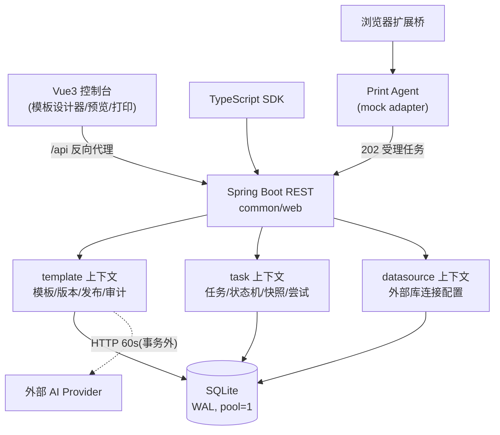

# 架构评审（2026-09-21）

评审范围：`backend/`（Spring Boot 4 + SQLite）、`frontend/print-console/`（Vue 3）、`print-agent/`、`sdk/`、`browser-extension/`、`tools/`。
评审方式：全量走读后端分层与状态机代码、数据层约束、前端渲染管线；结合离线验收、单元测试与并发测试验证结论。

## 一、架构还原

**总体判断：模块化单体（modular monolith），对当前规模是正确选型。** 按限界上下文分包（template/task/datasource/common），web→service→repository 分层严格，状态机独立成纯函数类，版本不可变 + 发布范围 + 审计链完整，前端打印渲染与后端契约（print-platform-layout-v1）清晰。 bones 是好的。

## 二、发现的问题与处置

### P1 并发正确性（已修复）

| # | 问题 | 位置 | 修复 |
|---|------|------|------|
| 1 | 状态机"读-校验-写"无锁，并发下非法转换可同时通过校验，最后写者胜出 | `PrintTaskService.transition/retry` | 仓储 UPDATE 增加 `AND status=? AND attempts=?` 期望条件，0 行命中抛 `InvalidTaskTransitionException`(409) |
| 2 | 模板并发写丢失更新：`saveDraft` revision+1、`publish` version+1、`rollback` 均为读-改-写 | `PrintTemplateService` | 仓储 UPDATE 增加 `AND draft_revision=? AND published_version IS ?`，0 行命中抛 `TemplateConflictException`(409，新增) |
| 3 | 并发重复编码创建撞唯一约束返回 500 | `PrintTemplateService.create` | 捕获 `DataIntegrityViolationException` 转语义化 400；全局处理器兜底映射 DIVE→409 |
| 4 | SQLite 未启用 WAL；`busy_timeout` 未设置 | `db/schema.sql` | 启动脚本顶部 `PRAGMA journal_mode=WAL` + `busy_timeout=5000`（WAL 随库文件持久化） |

连接池保持 `maximum-pool-size: 1`（SQLite 单写者的正确姿势），已在 yml 注明理由：并发由 Tomcat 线程承担，写竞态由服务层乐观锁兜底。**若未来调大连接池，乐观锁已就位，无需再改服务层。**

### P2 健壮性/可维护性（记录，建议短期处理）

| # | 问题 | 建议 |
|---|------|------|
| 5 | `print_task.business_key` 无唯一约束，上游重试会重复建任务（重复出纸风险） | 与业务方确认 businessKey 语义后加 `UNIQUE(template_code, business_key)`，重复创建返回既有任务（幂等） |
| 6 | `templates.list()` / `tasks.list()` 无分页，模板 design JSON 单条可达几十 KB | 短期内加 limit/offset 或游标分页 |
| 7 | 快照恒为 `{}`（mock 阶段占位） | 接入真实 agent 前必须落真实渲染快照，否则追溯链条断裂 |
| 8 | AI HTTP 调用超时 60s 且无重试/熔断 | AI 非核心路径，建议加超时降级开关（已有 UNAVAILABLE 分支，够用）与客户端重试上限 |
| 9 | 前端 `TemplateStudio.vue` 单文件 260+ 行、无路由无状态管理 | MVP 可接受；功能继续膨胀时引入 router + Pinia，拆分设计器子组件 |

### 已确认的亮点

- `TemplateAiService.recognize` 的外部 HTTP 调用**不在事务内**——单连接池下这是正确且关键的写法。
- CORS 收敛到 `http://localhost:5173`；异常处理器统一 ProblemDetail。
- schema 约束完整：`code UNIQUE`、`(template_id, version_no) UNIQUE`、快照 `task_id UNIQUE`。
- 版本发布/回滚生成新不可变版本而非覆盖，`recordRelease` 保证单一 active 发布。

## 三、验证结果（修复后全量回归）

| 层级 | 用例 | 结果 |
|---|---|---|
| 单元（Vitest） | 11（含新增 @page size 用例） | 全部通过 |
| 打印 E2E（Playwright + 真 Chrome） | 1（二维码/条码/表格 → 3 页 PDF） | 通过 |
| 后端集成（Spring BootTest） | 9 | 全部通过 |
| **并发集成（新增）** | **4**（状态机竞争/草稿序列化/并发发布唯一版本/重复编码唯一成功） | **全部通过** |
| **HTTP 并发（新增 tools/concurrency）** | **5**（100 并发创建/20 并发状态竞争/并发重复编码/并发 6 次发布/混合读突发） | **全部通过**，0 个 5xx |
| 端到端离线验收 | 18 | 全部通过 |

关键并发数字：100 并发建任务 p95≈2.2s（单写者串行化，符合预期）、20 并发状态竞争 = 1 成功 + 19×409 且终态/尝试数一致、并发发布版本号严格唯一递增 `[1..6]`。

## 四、优化路线图

### 立即行动（无需架构变更）
- [x] 乐观锁三处 + 异常映射 + WAL（本次完成）
- [ ] `business_key` 幂等（需业务确认语义，影响面：schema + create 语义）
- [ ] 列表分页（影响面：2 个 controller + 前端表格）

### 短期（1-3 个月）
- 接入真实 Print Agent：任务领取（agent 轮询/长轮询）、快照真实化、attempt 与 OS 打印结果对账。解决痛点 #7。
- 观测：请求日志 + 耗时指标（actuator 已暴露 health/info，补 metrics）。

### 中期（3-6 个月）
- 若多机构接入（SaaS 化）：SQLite → PostgreSQL（schema 兼容，repository 已用标准 SQL，迁移成本低）；数据库上下文（datasource/）已具备多库连接能力。
- 前端引入 router + Pinia，设计器组件化拆分。

### 长期
- 任务调度外置（DB 轮询 → 事件/队列），支撑横向扩容的打印执行器集群。
